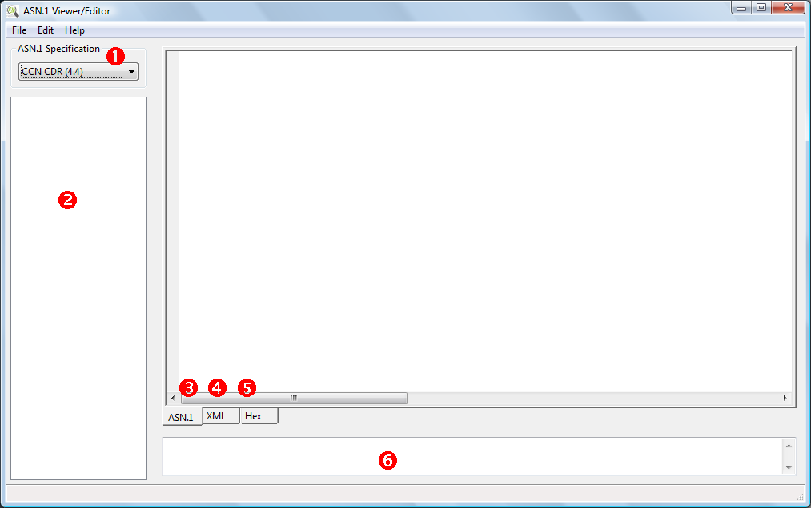
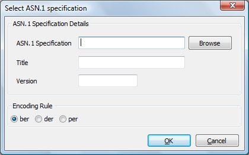

# REQUIREMENTS
 Erlang (http://www.erlang.org) needs to be installed on your system

# BUILD INSTRUCTION

## UNIX
> make;
> sudo make install 

## WINDOWS
> install.bat

# DECODING A FILE

 * Select the ASN.1 specification you expect the file to be encoded with
 * Select a file to encode
 
The tool consists of several elements:
 1. Select already imported ASN.1 Specification used for decoding the file
 2. Tree list showing all parts in the decoded file
 3. A textual representation of the decoded file closely following the ASN.1
    specification
 4. An XML view of the decoded data
 5. An Hex view of the raw data.
 6. Info text field



Any messages will be shown in the info text field (5)

## Editing (not working yet)
Changes can be made in the tree list and when saved will be reflected in the 
other views. The tool will only check if any changes are valid ASN.1 and you 
will have to make sure that any changes are correctly formed, e.g. in the case
of an AddressString, the tool can only check that it is a string of Octets,
the actual meaning of the octets is not know to the tool. 
 
# Importing ASN.1 Specification



 * Select ASN.1 specification. If your specification is broken up in several 
   parts, you need to provide a "set" file listing all parts. This is typically 
   the case when the ASN.1 specification contains IMPORT statements
 * Provide a title used in the dropdown list
 * Provide a version (in order to distinguish multiple version of the spec)
 * Indicate the encoding rules used. If you don't know use 'ber'.

If you get this error:
```
Compiling asn.1 specification: filename
got 'EXPLICIT' expected one of: 'typereference . typereference', typereference, 
    'TYPE-IDENTIFIER' or 'ABSTRACT-SYNTAX'
```

This is caused by a wrong use of the EXPLICIT statement. To solve this make 
sure to remove EXPLICIT in the tag assignment and add the EXPLICIT where-ever 
the tag is referenced.

## EXAMPLE
 
Look for a tag that is tagged EXPLICIT like this

``` 
 GSNAddress ::= EXPLICIT IPBinaryAddress

 :
 
 ServingElement ::= CHOICE {
	originInfo                 [0] OriginInfo,
	mSCAddress                 [1] AddressString,
	ggsnAddress                [2] GSNAddress,
	sgsnAddress                [3] GSNAddress,
	...
}
```

Remove the EXPLICIT keyword  and add it in front of tag  when referenced

```
 GSNAddress ::= IPBinaryAddress

 :
 
 ServingElement ::= CHOICE {
	originInfo                 [0] OriginInfo,
	mSCAddress                 [1] AddressString,
	ggsnAddress                [2] EXPLICIT GSNAddress,
	sgsnAddress                [3] EXPLICIT GSNAddress,
	...
}
```

and it will work.